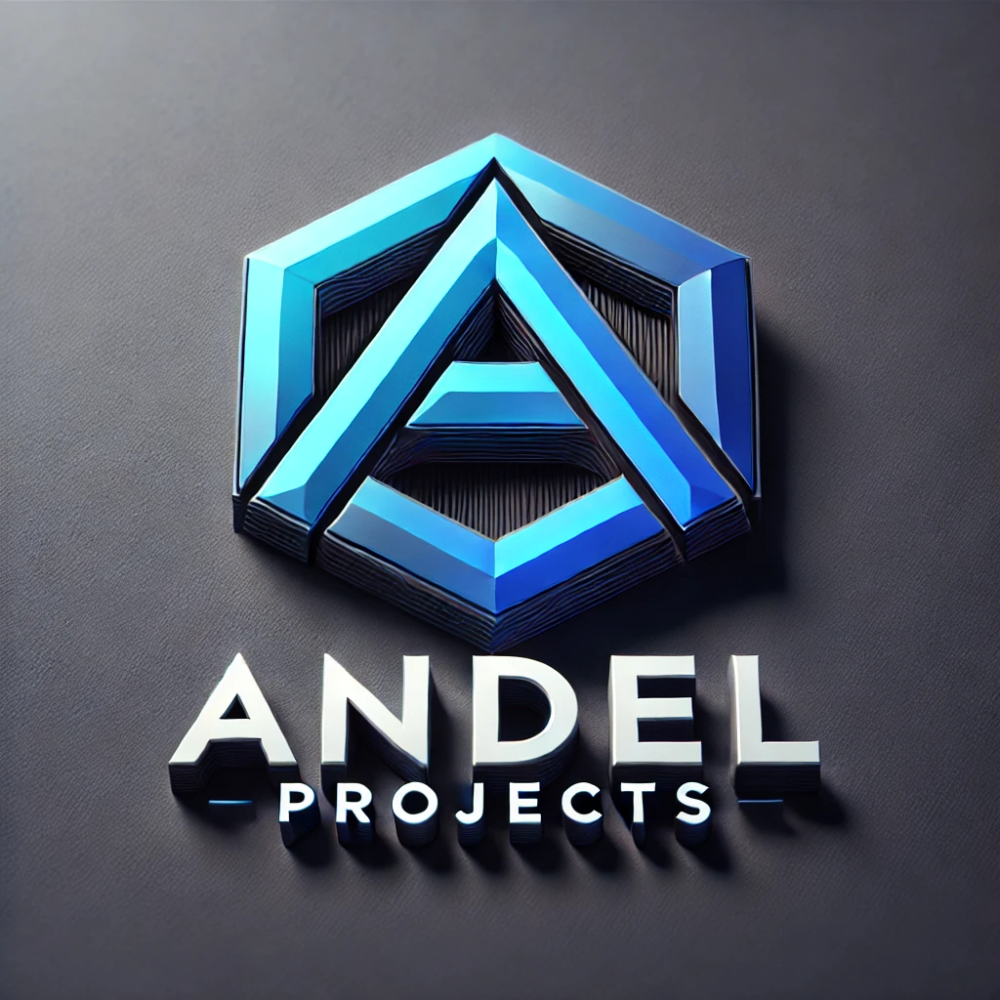

# First Draft Guide for Building Vega Gantt Charts

This document is a first draft aimed at providing a detailed step-by-step guide to creating Gantt charts using the Vega visualization framework. It outlines the key components, data structures, and processes required to effectively compose a Gantt chart with interactive capabilities.

---

## Step 1: Data Preparation

### Data Ingestion

Your data source typically includes attributes such as `task`, `phase`, `start`, `end`, and `completion`. Example format:

<details open>
  <summary>Click to expand/collapse the code</summary>

```json
[
  {
    "id": 1,
    "phase": "Planning",
    "task": "Project Kickoff",
    "start": "2024-06-01",
    "end": "2024-06-03",
    "completion": 100,
    "status": "Complete"
  }
]
```

</details>

Ensure dates are formatted for parsing, and other fields are properly structured based on chart requirements.

### Data Transformations

Use Vega's built-in transformations to process data.
Example:

<details open>
  <summary>Click to expand/collapse the code</summary>

```json
{
  "type": "formula",
  "as": "duration",
  "expr": "(datetime(datum.end) - datetime(datum.start)) / (1000 * 60 * 60 * 24)"
}
```

</details>

---

## Step 2: Signals Setup

### Define Interactivity Signals

Signals control zooming, panning, and other behaviors.
Example:

<details open>
  <summary>Click to expand/collapse the code</summary>
  
```json
{
  "name": "zoom",
  "value": 1,
  "on": [
    {
      "events": "wheel!",
      "update": "pow(1.001, event.deltaY)"
    }
  ]
}
```
</details>

### Dynamic Calculations

Set up signals to compute chart size, scales, and interactions dynamically.

---

## Step 3: Scales Configuration

### Define Scales for Axes

Scales map data to visual properties.
Example `x` scale for time:

<details open>
  <summary>Click to expand/collapse the code</summary>

```json
{
  "name": "x",
  "type": "time",
  "domain": { "data": "input", "field": "start" },
  "range": "width"
}
```

</details>

### Color Scales

Use `ordinal` or `linear` scales for mapping data to colors.
Example:

<details open>
  <summary>Click to expand/collapse the code</summary>

```json
{
  "name": "color",
  "type": "ordinal",
  "domain": { "data": "input", "field": "phase" },
  "range": ["#1f77b4", "#ff7f0e"]
}
```

</details>

---

## Step 4: Creating Marks for Visualization

### Task Bars

Represent tasks using `rect` marks.
Example:

<details open>
  <summary>Click to expand/collapse the code</summary>

```json
{
  "type": "rect",
  "from": { "data": "input" },
  "encode": {
    "update": {
      "x": { "scale": "x", "field": "start" },
      "x2": { "scale": "x", "field": "end" },
      "y": { "scale": "y", "field": "task" },
      "fill": { "scale": "color", "field": "phase" }
    }
  }
}
```

</details>

### Milestones and Symbols

Use `symbol` marks to denote milestones.

### Text Labels

Add labels for tasks using `text` marks.

---

## Step 5: Configuring Interactivity

### Event Handling

Handle mouse events for tooltips and interactions.
Example:

<details open>
  <summary>Click to expand/collapse the code</summary>

```json
{
  "name": "hover",
  "value": {},
  "on": [
    { "events": "rect:mouseover", "update": "datum" },
    { "events": "rect:mouseout", "update": "{}" }
  ]
}
```

</details>

### Collapsible Sections

Control visibility and expansion/collapse states using signals and marks.

---

## Step 6: Axes and Legends (Optional)

### X and Y Axes

Configure axes to display dates and labels.

### Legends

Add legends for visual encodings.

---

## Step 7: Fine-Tuning and Customization

### Styling and Theming

Apply consistent fonts, colors, and styles using Vega's `config` object.

### Responsive Layouts

Make layouts responsive with signals and dynamic range adjustments.

---

## Summary Flowchart (Key Process Overview)

```plaintext
            [Data Preparation]
                   |
   -------------------------------
   |             |              |
[Transforms]   [Signals]      [Scales]
   |             |              |
   ---------------------------------
   |                                |
[Marks for Tasks/Milestones/Labels] [Interactivity Setup]
   |                                |
   ------------------------------
   |                            |
 [Axes and Legends]       [Styling and Tuning]
```
