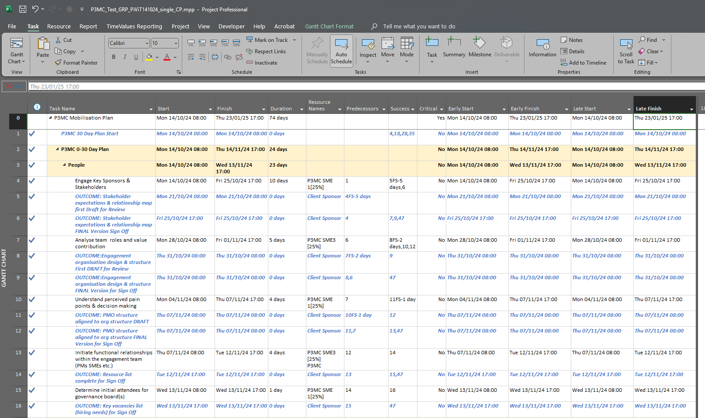

# Importing Microsoft Project Data into Power BI Using Python

## ScreenShots

### MS Project File



## Overview

This guide provides step-by-step instructions for importing task data from a Microsoft Project (`.mpp`) file into Power BI using a Python script. The script leverages the COM automation interface provided by Microsoft Project to extract task details and presents them in a format that Power BI can consume.

## Table of Contents

1. [Prerequisites](#prerequisites)
2. [Installation and Setup](#installation-and-setup)
   - [1. Install Python](#1-install-python)
   - [2. Install Required Python Libraries](#2-install-required-python-libraries)
   - [3. Configure Python in Power BI Desktop](#3-configure-python-in-power-bi-desktop)
   - [4. Ensure Software Architecture Consistency](#4-ensure-software-architecture-consistency)
   - [5. Adjust Security and Privacy Settings in Power BI](#5-adjust-security-and-privacy-settings-in-power-bi)
   - [6. Set Up the Power BI Query](#6-set-up-the-power-bi-query)
   - [7. Test the Connection](#7-test-the-connection)
   - [8. Apply Changes and Load Data](#8-apply-changes-and-load-data)
3. [Script Explanation](#script-explanation)
4. [Permissions and Security Considerations](#permissions-and-security-considerations)
5. [Common Troubleshooting Steps](#common-troubleshooting-steps)
6. [Final Notes](#final-notes)

---

## Prerequisites

Before running this script, ensure you have the following:

- **Microsoft Windows Operating System**: Required for running Microsoft Project and Power BI Desktop.
- **Microsoft Project**: Installed on your machine. Ensure it's the same bit version (32-bit or 64-bit) as your Power BI and Python installations.
- **Power BI Desktop**: Installed on your machine.
- **Python**: Installed and properly configured with Power BI. Python 3.6 or higher is recommended.
- **Administrative Privileges**: You may need administrator rights to install software and adjust certain settings.

## Installation and Setup

### 1. Install Python

- **Download Python**:

  - Visit the official Python website: [https://www.python.org/downloads/](https://www.python.org/downloads/).
  - Download the latest version of Python 3.x for Windows.

- **Install Python**:
  - Run the installer.
  - **Important**: During installation, check the box that says **"Add Python to PATH"**. This makes Python accessible from the command line.

### 2. Install Required Python Libraries

- **Open Command Prompt**:

  - Press `Win + R`, type `cmd`, and press Enter.

- **Install Libraries**:

  - Run the following commands to install necessary Python packages:

    ```bash
    pip install pandas
    pip install pywin32
    ```

- **Run PyWin32 Post Install Script**:

  - After installing `pywin32`, run:

    ```bash
    python Scripts\pywin32_postinstall.py -install
    ```

  - This registers the COM extensions, which are necessary for interacting with Microsoft Project.

### 3. Configure Python in Power BI Desktop

- **Open Power BI Desktop**.

- **Set Python Home Directory**:
  - Go to **File** > **Options and settings** > **Options**.
  - In the left sidebar, select **Python scripting** under **Global**.
  - Set the **Python home directory** to the path where Python is installed (e.g., `C:\Users\YourUsername\AppData\Local\Programs\Python\Python39`).
  - Click **OK** to save the settings.

### 4. Ensure Software Architecture Consistency

- **Check Bit Versions**:
  - Make sure that Microsoft Project, Power BI Desktop, and Python are all either 32-bit or 64-bit. Mixing different architectures can cause compatibility issues.

### 5. Adjust Security and Privacy Settings in Power BI

- **Allow Native Queries**:

  - Go to **File** > **Options and settings** > **Options**.
  - Under **Current File**, select **Security**.
  - Uncheck **"Require user approval for new native database queries"** to allow the Python script to run.

- **Adjust Privacy Level Settings**:
  - Under **Current File**, select **Privacy**.
  - Choose **"Ignore the Privacy Levels and potentially improve performance"**.
  - **Note**: Changing privacy settings can have security implications. Ensure this complies with your organization's policies.

### 6. Set Up the Power BI Query

- **Open Power Query Editor**:

  - In Power BI Desktop, click on **Transform data** on the Home tab.

- **Create a New Blank Query**:

  - Click **New Source** > **Blank Query**.

- **Open Advanced Editor**:

  - Right-click the new query and select **Advanced Editor**.

- **Paste the M Code**:

  - Copy the complete M code provided below and paste it into the Advanced Editor.

- **Set the `ProjectFile` Parameter**:

  - At the top of the M code (before the `let` statement), define the `ProjectFile` parameter:

    ```m
    ProjectFile = "C:\Users\User\Downloads\YourProjectFile.mpp",
    ```

  - Replace `"C:\Users\User\Downloads\YourProjectFile.mpp"` with the actual path to your `.mpp` file.

- **Save and Close**:
  - Click **Done** to close the Advanced Editor.

### 7. Test the Connection

- **Refresh the Query**:

  - In the Power Query Editor, click **Refresh Preview** to test the script.

- **Review the Data**:
  - Ensure that the task data from your Microsoft Project file is displayed correctly.

### 8. Apply Changes and Load Data

- **Close & Apply**:

  - Click **Close & Apply** in the Power Query Editor to load the data into Power BI.

- **Verify Data in Power BI**:
  - In the main Power BI window, check the Fields pane to see if your task data is available.

---

## Script Explanation

### Complete M Code with Embedded Python Script

```m
let
    // Replace backslashes in the file path with double backslashes for proper escaping
    escapedFilePath = Text.Replace(ProjectFile, "\", "\\"),

    // Construct the Python script as a text block
    script = "
import pandas as pd
import win32com.client  # Library for COM automation
import pythoncom        # For managing COM threading
import time             # For adding delays
import os               # For file path operations
import pywintypes       # For handling date conversions
import traceback        # For detailed error reporting

# Set the file path to the Microsoft Project file
file_path = r'''[FilePathPlaceholder]'''

# Check if the file path is provided
if not file_path:
    raise ValueError('No file path provided.')

# Verify that the file exists at the specified path
if not os.path.isfile(file_path):
    raise FileNotFoundError(f'The file does not exist: {file_path}')

# Initialize an empty list to store task data
tasks = []

try:
    pythoncom.CoInitialize()  # Initialize COM threading
    app = win32com.client.Dispatch('MSProject.Application')  # Start MS Project application
    app.Visible = False  # Run MS Project in the background
    time.sleep(1)  # Wait a moment to ensure the app is ready

    print(f'Attempting to open file: {file_path}')
    app.FileOpen(file_path)  # Open the specified project file
    project = app.ActiveProject  # Get the active project

    # Retrieve the number of working hours per day from the project settings
    hours_per_day = project.HoursPerDay
    minutes_per_day = hours_per_day * 60  # Convert hours to minutes

    # Iterate through each task in the project
    for task in project.Tasks:
        if task is not None:
            try:
                # Convert the Start date to a string in ISO 8601 format
                start_date = task.Start
                if start_date:
                    start_date = pywintypes.Time(start_date)
                    start_date = start_date.strftime('%Y-%m-%dT%H:%M:%S')
                else:
                    start_date = ''

                # Convert the Finish date to a string in ISO 8601 format
                finish_date = task.Finish
                if finish_date:
                    finish_date = pywintypes.Time(finish_date)
                    finish_date = finish_date.strftime('%Y-%m-%dT%H:%M:%S')
                else:
                    finish_date = ''

                # Adjust the task Duration from minutes to days based on project settings
                if minutes_per_day and isinstance(task.Duration, (int, float)):
                    duration_in_days = task.Duration / minutes_per_day
                else:
                    duration_in_days = 0  # Default to 0 if invalid

                # Append the task data to the tasks list
                tasks.append({
                    'ID': task.ID,
                    'Name': task.Name or '',
                    'Duration': duration_in_days,
                    'Start': start_date,
                    'Finish': finish_date,
                    'ResourceNames': task.ResourceNames or ''
                })
            except Exception as e:
                # If there's an error with this task, print the error and continue
                print(f'Error processing task ID {task.ID}: {e}')
                traceback.print_exc()
                # Optionally, add default values for this task
                tasks.append({
                    'ID': task.ID,
                    'Name': task.Name or '',
                    'Duration': 0,
                    'Start': '',
                    'Finish': '',
                    'ResourceNames': ''
                })

except Exception as e:
    # Handle any errors that occur during processing
    print('An error occurred during processing:', e)
    traceback.print_exc()
    # Optionally re-raise the exception to halt execution
    # raise e

finally:
    # Ensure that MS Project is properly closed and resources are released
    try:
        if 'app' in locals() and app is not None:
            app.FileCloseEx(SaveChanges=False)  # Close the project without saving
            app.Quit()  # Quit the MS Project application
    except Exception as e:
        print('Error during cleanup:', e)
        traceback.print_exc()
    finally:
        pythoncom.CoUninitialize()  # Uninitialize COM threading

# After processing, create a DataFrame from the tasks list
df_tasks = pd.DataFrame(tasks)
# Replace any missing values with empty strings to prevent errors in Power BI
df_tasks = df_tasks.fillna('')
",
    // Replace the placeholder with the actual file path
    scriptWithFilePath = Text.Replace(script, "[FilePathPlaceholder]", escapedFilePath),

    // Execute the Python script
    Source = Python.Execute(scriptWithFilePath),

    // Retrieve the DataFrame containing the task data
    df_tasks = Source{[Name="df_tasks"]}[Value]
in
    // Output the task data to Power BI
    df_tasks
```

### Explanation for Non-Technical Users

**Power BI M Code Section:**

- **`escapedFilePath`**: Prepares the file path by replacing single backslashes (`\`) with double backslashes (`\\`). This is necessary because backslashes are special characters in programming languages.

- **`script`**: Contains the Python script as a text block. The script will be executed within Power BI to extract data from the Microsoft Project file.

- **`scriptWithFilePath`**: Replaces the `[FilePathPlaceholder]` in the Python script with the actual file path. This ensures the script knows which file to process.

- **`Source`**: Executes the Python script and captures the output.

- **`df_tasks`**: Extracts the DataFrame named `df_tasks` from the script's output, which contains the task data.

- **`in df_tasks`**: Specifies that the final output of this query is the `df_tasks` table, which will be available in Power BI.

**Embedded Python Script:**

- **Imports Necessary Libraries**:

  - `pandas`: For data manipulation and creating DataFrames.
  - `win32com.client`: To interact with COM objects (Microsoft Project in this case).
  - `pythoncom`: For COM threading management.
  - `time`: For adding delays when needed.
  - `os`: For file operations.
  - `pywintypes`: For handling date and time conversions from COM objects.
  - `traceback`: For detailed error logging.

- **File Path Setup**:

  - Sets the `file_path` variable to point to the Microsoft Project file you wish to import.

- **Error Checking**:

  - Checks if the file path is provided and if the file exists at that location. Raises an error if not.

- **Initialize COM and Open MS Project**:

  - Initializes COM threading and starts the Microsoft Project application in the background.

- **Retrieve Project Settings**:

  - Gets the number of working hours per day (`HoursPerDay`) from the project settings to correctly calculate task durations.

- **Process Each Task**:

  - Iterates over all tasks in the project.
  - Converts the `Start` and `Finish` dates to a standard format.
  - Adjusts the `Duration` from minutes to days based on the project's working hours.
  - Collects relevant task information and appends it to the `tasks` list.

- **Exception Handling**:

  - If an error occurs while processing a task, it logs the error and continues with the next task.

- **Cleanup**:

  - Ensures that the Microsoft Project application is closed properly and COM resources are released, even if an error occurs.

- **Create DataFrame**:
  - After processing all tasks, it creates a Pandas DataFrame `df_tasks` from the `tasks` list.
  - Replaces any missing values with empty strings to prevent issues when importing into Power BI.

---

## Permissions and Security Considerations

- **File Access Permissions**:

  - Ensure that you have read access to the Microsoft Project file and the directories involved.

- **Administrative Rights**:

  - You may need to run Power BI Desktop as an administrator, especially if you encounter permission-related errors.

- **Antivirus and Firewall Settings**:

  - Sometimes, security software may block scripts or applications from accessing certain files or executing code. You may need to adjust settings or create exceptions.

- **Data Security**:
  - Always handle project data carefully, especially if it contains sensitive information.

---

## Common Troubleshooting Steps

- **FileNotFoundError**:

  - Verify that the file path is correct and that the file exists.
  - Ensure that backslashes in the file path are properly escaped.

- **COM Errors**:

  - Make sure that Microsoft Project is properly installed and licensed.
  - Confirm that the bit versions of all software components match.

- **Python Package Errors**:

  - Ensure all required Python packages are installed.
  - If you encounter import errors, try reinstalling the package.

- **Script Execution Errors**:

  - Check that the indentation and syntax in the Python script are correct.
  - Ensure that any quotation marks within the script are properly escaped.

- **Permission Errors**:

  - Run Power BI Desktop as an administrator.
  - Check file and folder permissions.

- **Data Import Issues**:
  - Verify that the data types in the DataFrame are compatible with Power BI.
  - Handle missing or null values appropriately.

---

## Final Notes

- **Testing the Script Independently**:

  - If you encounter issues, you can test the Python script outside of Power BI by running it in a Python environment and ensuring it works as expected.

- **Consulting IT Support**:

  - If you're in a managed IT environment, you may need assistance from your IT department to adjust settings or install software.

- **Regular Updates**:

  - Keep your software and Python packages up to date to benefit from the latest features and security updates.

- **Feedback and Collaboration**:
  - Share this guide with team members and collaborate on any further enhancements or troubleshooting.

---

**Thank you for using this guide! If you have any questions or need further assistance, feel free to reach out.**
